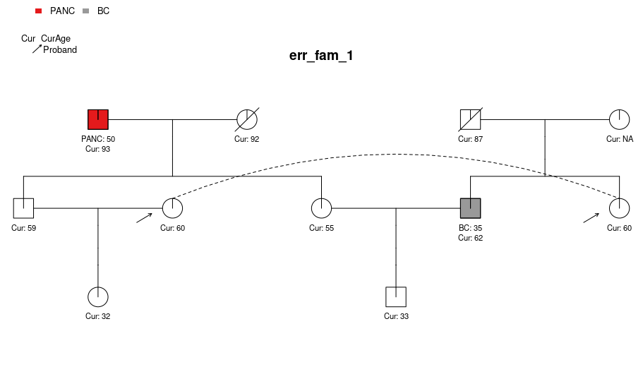
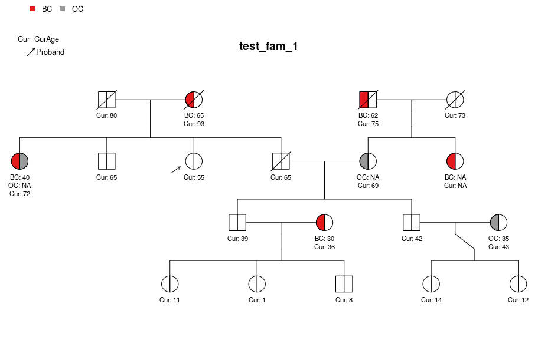
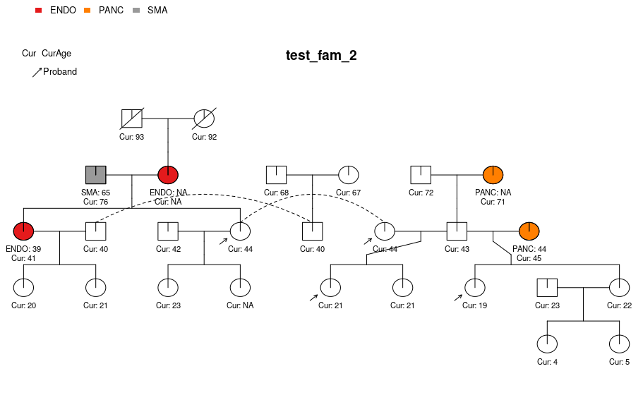
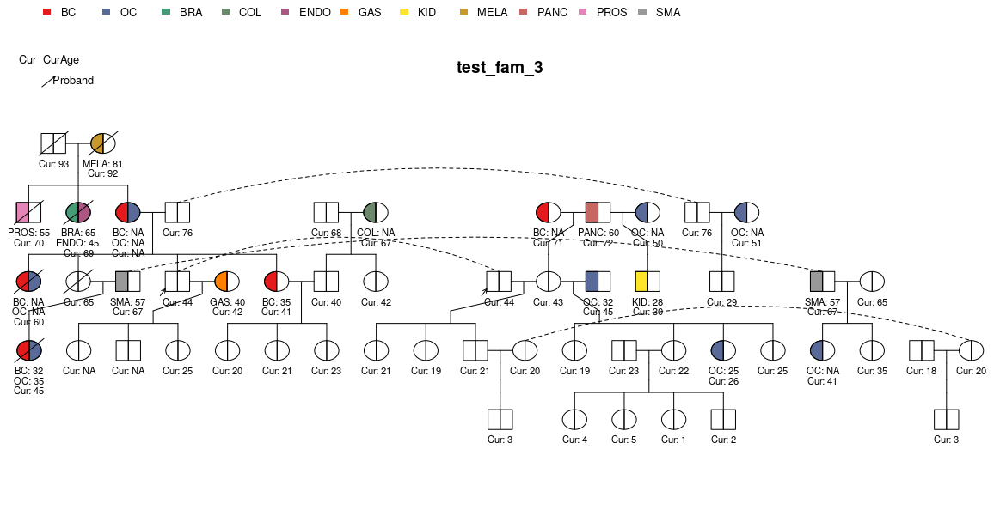
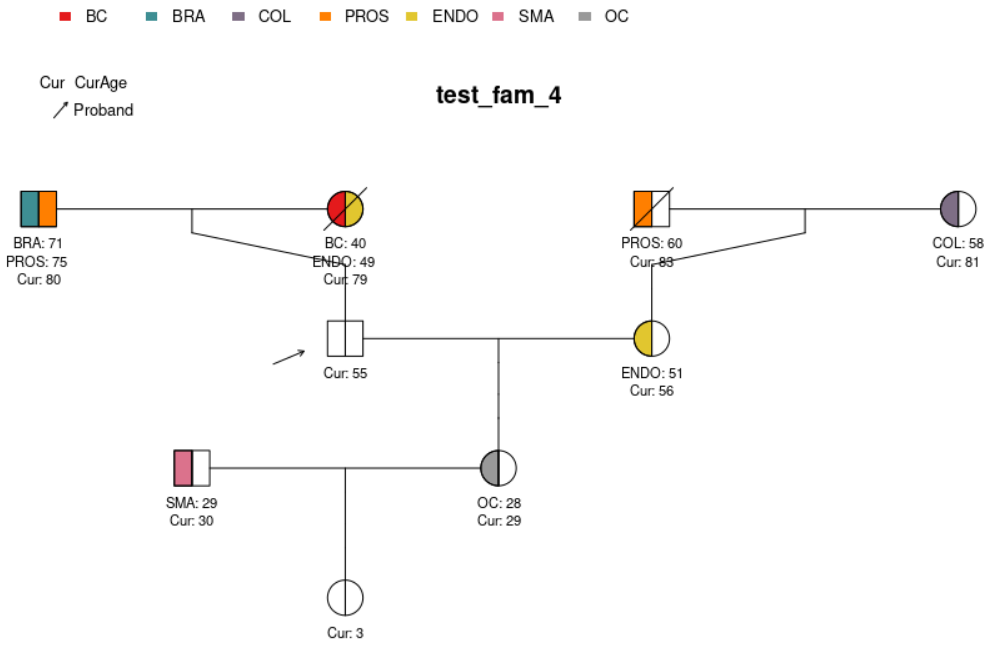

```{r, include = FALSE}
knitr::opts_chunk$set(
  collapse = TRUE,
  comment = "#>"
)
```

This is a guide on creating and working with pedigrees in the `PanelPRO` R package.

The family history user input to the main `PanelPRO` function is `pedigree`, which is a `data.frame` with certain required columns. See `help(PanelPRO)` for more detail on the expected values for these columns. This package includes four sample pedigrees: `test_fam_1`, `test_fam_2`, `test_fam_3`, `test_fam_4` and `err_fam_1`. These examples are intended to show users different kinds of pedigrees that can be useful for illustrating the capabilities of the `PanelPRO` package. 

```{r}
library(PanelPRO)
```


## Pedigree input

There are many ways one can specify or define a `data.frame` in R. Below is an example for creating `err_fam_1`.

```{r err_fam_1_definition}
# err_fam_1 data.frame set up example

# Set up basic required columns
err_fam_1 <- data.frame("ID" = 1:10)
err_fam_1$Sex <- c(0, 1, 0, 1, 0, 1, 0, 1, 0, 1)

err_fam_1$MotherID <- c(NA, NA, NA, NA, 1, 1, 3, 3, 7, 5)
err_fam_1$FatherID <- c(NA, NA, NA, NA, 2, 2, 4, 4, 6, 8)

err_fam_1$isProband <- 0
err_fam_1[err_fam_1$ID == 7, "isProband"] <- 1

err_fam_1$CurAge <- c(92, 93, NA, 87, 55, 59, 60, 62, 32, 33)

err_fam_1$isDead <- 0
err_fam_1[err_fam_1$ID %in% c(1, 4), "isDead"] <- 1

err_fam_1$Twins <- 0

err_fam_1$riskmod <- list(character(0))
err_fam_1[err_fam_1$ID == 8, "riskmod"] <- "Oophorectomy"
err_fam_1$interAge <- NA
err_fam_1[err_fam_1$ID == 8, "interAge"] <- 40

err_fam_1$race <- "Black"
err_fam_1$Ancestry <- "nonAJ"

# Set up cancers
# Pancreatic cancer
err_fam_1$isAffPANC <- 0
err_fam_1$AgePANC <- NA
err_fam_1[err_fam_1$ID == 2, "isAffPANC"] <- 1
err_fam_1[err_fam_1$ID == 2, "AgePANC"] <- 50

# Breast cancer
err_fam_1$isAffBC <- 0
err_fam_1$AgeBC <- NA
err_fam_1[err_fam_1$ID == 8, "isAffBC"] <- 1
err_fam_1[err_fam_1$ID == 8, "AgeBC"] <- 35
```


The `err_fam_1` pedigree can be visualized with the `visPed` package as follows:



Note that this pedigree contains so-called 'loops' (see Fernando et al., 1993), which are not currently supported by `PanelPRO`. Attempting to run a `PanelPRO` model for pedigrees with loops will result in an error. 

```{r, error = TRUE}
PanelPRO(err_fam_1, cancers = c("Breast", "Pancreas"), genes = c("MSH2", "TP53"))
```

The other pedigrees can be visualized as follows:








For more information about each of the sample families provided by the `PanelPRO` package, please see their individual help pages. 

## References 

Fernando, R. L., C. Stricker, and R. C. Elston. "An efficient algorithm to compute the posterior genotypic distribution for every member of a pedigree without loops." Theoretical and Applied Genetics 87.1 (1993): 89-93.
